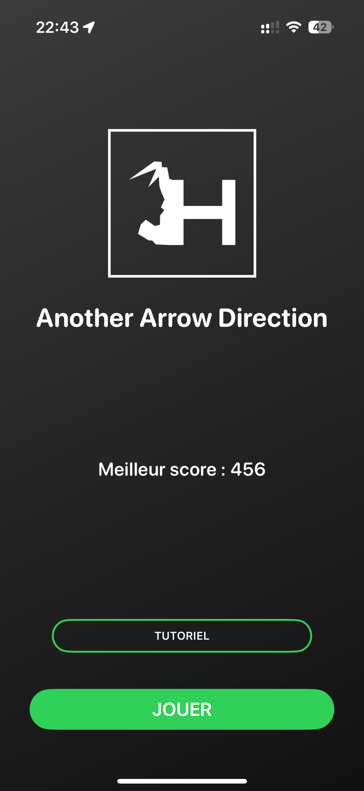
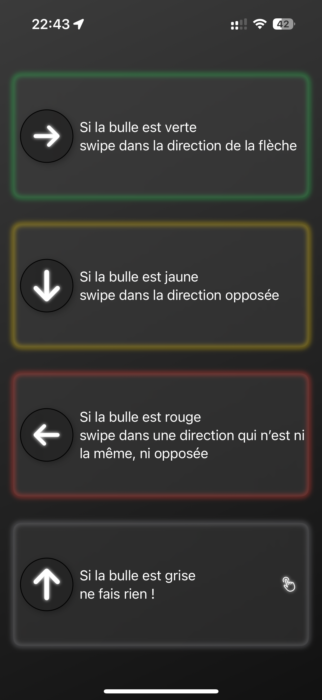
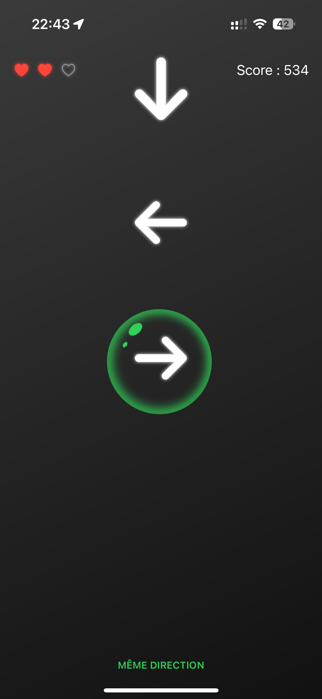
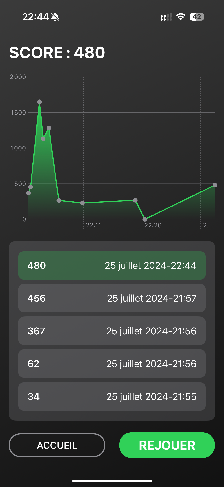

# Another Arrow Direction

Here's an alternative to Impulse's Arrow Direction minigame.  
This project was done as a technical test for Voodoo, and during my workday at Capgemini.  
I received the test on 25-07-2024 at 0910 am and my last commit (for the test, and excepting the commit for this readme commit) was pushed at 1057 pm.  

## Principle

- User have to swipe in the direction indicated by the arrow on the screen
- A modifier can impact the way user should swipe
- The more the arrow is at the center of the bubble, the more points user will earned

## Screens

| | |
|:-------------------------:|:-------------------------:|
| Home Screen |   Tutorial Screen |
| Game Screen |   End Screen |

## Gameplay

You can find a video of the gameplay [here](Images/Gameplay.mp4)

---

⚠️ Project built with Xcode 16 beta 3 & macOS 15 beta 3 ⚠️  
It was compiled for iOS 17 so it should work as is, but... beta
